# 🔭 Monetique Eye — Enterprise Observability Platform

> **Version**: 2.0.0 | **Status**: Production Ready | **Author**: Monetique Team | **Year**: 2026

---

## 📋 Executive Summary

**Monetique Eye** is a full-stack, enterprise-grade observability platform designed for seamless infrastructure monitoring, automated deployment orchestration, and intelligent operational insights. It eliminates the operational complexity traditionally associated with multi-node monitoring by providing a **"Push-Button" infrastructure model**: clients run one Ansible script, and the admin performs one-click deployment from the UI — instantly provisioning full monitoring, log aggregation, alerting, and ticket collaboration.

### 🏆 Key Technical Highlights

| Highlight | Description |
|:---|:---|
| **Full-Stack Architecture** | Spring Boot 3.3 backend + React 19 frontend + MySQL 8 |
| **Observability Stack** | Prometheus + Grafana + ELK (Elasticsearch, Logstash, Filebeat) |
| **AI-Powered Intelligence** | Groq Llama 3.3 (70B) for automated log analysis and operational insights |
| **GitOps Infrastructure** | Ansible + Docker + Jenkins CI/CD pipelines |
| **Enterprise RBAC** | Environment-level, permission-granular access control with JWT |
| **One-Click Deployment** | Backend-orchestrated SSH + Ansible for zero-touch node provisioning |
| **Multi-Cluster Support** | Cluster → Environment → Node → Application hierarchy |
| **Incident Management** | Alertmanager-integrated incident lifecycle with AI summarization |

---

# 1. 🎯 Project Overview

## 1.1 Project Title

**Monetique Eye** — Enterprise Observability & Infrastructure Management Platform

## 1.2 Context

In modern enterprise environments — particularly in the **monetique (electronic payments/financial services)** sector — infrastructure reliability is critical. Downtime directly impacts financial transactions, customer trust, and regulatory compliance. Traditional monitoring solutions require significant manual configuration, are fragmented across tools, and lack unified intelligence.

## 1.3 Problem Statement

Enterprise IT teams managing distributed infrastructure face:
- **Fragmented tooling** — separate dashboards for metrics, logs, alerts, and incidents
- **Complex onboarding** — provisioning monitoring agents on new nodes requires deep DevOps expertise
- **Lack of AI-driven insights** — operators manually correlate logs, metrics, and alerts
- **No unified deployment tracking** — CI/CD events are disconnected from observability data
- **Limited access control** — most monitoring platforms lack fine-grained, environment-level RBAC

## 1.4 Objectives

1. **Unify** metrics, logs, alerts, and incidents into a single platform
2. **Automate** infrastructure provisioning with one-click agent deployment
3. **Integrate AI** for intelligent log analysis, anomaly detection, and root cause inference
4. **Enable GitOps** with Jenkins CI/CD pipelines and version-controlled monitoring configuration
5. **Enforce security** with JWT authentication and environment-scoped RBAC
6. **Provide scalability** with cluster and environment hierarchy for multi-tenant management

## 1.5 Target Users

| User Persona | Use Case |
|:---|:---|
| **CTO / VP Engineering** | Global health overview, stability metrics, business risk assessment |
| **DevOps Engineers** | Node provisioning, deployment orchestration, monitoring config management |
| **SRE / Ops Teams** | Alert triage, incident management, log analysis, root cause investigation |
| **Software Developers** | Application observability, deployment tracking, error debugging |
| **Security Officers** | Access control, audit logs, permission management |

## 1.6 Business Value

- **Reduce MTTR** (Mean Time To Resolution) through AI-assisted diagnostics
- **Eliminate manual provisioning** — hours → minutes for new node onboarding
- **Improve SLA compliance** through proactive alerting and predictive analytics
- **Lower operational costs** by consolidating 5+ tools into a single platform
- **Ensure audit compliance** with built-in activity logging and RBAC

---

# 2. 🔍 Existing Problem / Motivation

## 2.1 Problems Solved

| Problem | How Monetique Eye Solves It |
|:---|:---|
| **Fragmented monitoring** | Unified dashboard for metrics (Prometheus), logs (ELK), and alerts (Alertmanager) |
| **Manual node provisioning** | One-click agent deployment via backend-orchestrated Ansible playbooks |
| **Disconnected CI/CD** | Jenkins pipeline integration with deployment tracking and Grafana annotations |
| **Alert fatigue** | Intelligent alert grouping, AI-powered summarization, and severity correlation |
| **Lack of visibility** | Interactive topology graph, node heatmaps, and real-time service resource views |
| **No AI assistance** | Integrated Groq Llama 3.3 chatbot with real-time infrastructure context |

## 2.2 Limitations of Traditional Systems

1. **Prometheus + Grafana alone** — require manual configuration of targets, dashboards, and alerts for each new service
2. **ELK Stack standalone** — powerful but complex to correlate with metric-based alerts
3. **Jenkins standalone** — deployment events are siloed, not correlated with observability data
4. **Ansible alone** — requires SSH access and inventory management expertise
5. **No unified RBAC** — each tool has its own auth model, creating inconsistent access policies

## 2.3 Technical Challenges Addressed

- **Air-gapped environments**: Docker images are pre-exported and transferred as tarballs for nodes without internet
- **Non-root deployments**: Standalone mode installs Node Exporter as a systemd user service (no root/sudo required)
- **Multi-source log normalization**: Logstash pipeline normalizes logs from Filebeat, direct TCP, and Loki sources
- **Dynamic service discovery**: Prometheus file-based SD is auto-generated by the backend, no manual config needed
- **Cross-environment isolation**: Each environment has its own Prometheus label, log index, and RBAC scope

---

# 3. 📝 Functional Requirements

## 3.1 Core Features

| Feature | Description | User Role |
|:---|:---|:---|
| **Dashboard** | Global stability index, active agents, environment health, network load | All |
| **Environment Management** | CRUD environments with cluster assignment and Prometheus label | Admin |
| **Node Management** | Add/remove monitored nodes with one-click agent deployment | Admin |
| **Application Management** | Register, deploy, restart, undeploy applications on remote nodes | Admin |
| **Real-time Monitoring** | CPU, RAM, disk, network metrics per node/container/service | All |
| **Infrastructure Topology** | Interactive graph visualization of clusters, environments, and nodes | All |
| **Log Management** | Search, filter, and analyze logs by environment, service, severity | All |
| **Alert Management** | View active alerts, silence rules, create/delete alert rules | Admin |
| **Incident Management** | Create, track, and resolve incidents with AI summaries | All |
| **Ticketing System** | Create, assign, and resolve tickets linked to environments/applications | All |
| **AI Chat Assistant** | Natural language queries about infrastructure with real-time context | All |
| **Deployment Tracking** | CI/CD event recording, deployment history, pipeline triggering | All |
| **User Management** | Create users, assign roles, manage environment-level permissions | Admin |
| **Audit Logging** | Activity log for all system-level actions | Admin |
| **Documentation** | Built-in platform documentation accessible from the UI | All |
| **Network Monitor** | Blackbox probing and network health assessment | All |
| **Operational Intelligence** | AI-powered daily digests, anomaly detection, correlation analysis | All |

## 3.2 API Endpoints

| Category | Endpoint | Method | Description |
|:---|:---|:---|:---|
| **Auth** | `/api/auth/login` | POST | JWT authentication |
| **Environments** | `/api/environments` | GET/POST/PUT/DELETE | Environment CRUD |
| **Applications** | `/api/applications` | GET/POST/PUT/DELETE | Application lifecycle |
| **Deploy** | `/api/environments/{id}/deploy` | POST | One-click agent deployment |
| **Logs** | `/api/logs` | GET | Log search and retrieval |
| **Alerts** | `/api/alerts/ingest` | POST | Alertmanager webhook receiver |
| **Tickets** | `/api/tickets` | GET/POST/PUT/DELETE | Ticket management |
| **Incidents** | `/api/incidents` | GET/POST/PUT | Incident lifecycle |
| **CI/CD** | `/api/v1/deployments/events` | POST | Deployment event recording |
| **CI/CD** | `/api/v1/cicd/trigger` | POST | Jenkins pipeline trigger proxy |
| **Chat** | `/api/chat` | POST | AI assistant queries |
| **Infrastructure** | `/api/infrastructure/topology` | GET | Topology graph data |
| **Monitoring** | `/api/monitoring/node/{id}` | GET | Node metric aggregation |
| **Permissions** | `/api/admin/permissions` | GET/POST/PUT | RBAC management |
| **Users** | `/api/admin/users` | GET/POST/PUT/DELETE | User management |
| **Prometheus** | `/api/prometheus/query` | GET | Prometheus proxy |
| **Audit** | `/api/activity-logs` | GET | Activity audit trail |
| **GitHub** | `/api/github/*` | Various | GitHub integration |

## 3.3 Authentication & Authorization Features

| Feature | Implementation |
|:---|:---|
| **JWT Authentication** | `jjwt-api 0.12.6` with Bearer token pattern |
| **Stateless Sessions** | `SessionCreationPolicy.STATELESS` |
| **RBAC** | `ADMIN` / `USER` roles with environment-scoped permissions |
| **Fine-Grained Permissions** | 16+ permission keys (e.g., `MONITORING_LOGS`, `APP_DEPLOYMENT_CREATE`) |
| **Environment Scope Enforcement** | AOP-based `@RequiresPermission` with automatic environment ID extraction |
| **Cluster Access Control** | Users are assigned to specific environments within clusters |
| **Actuator Bypass** | `/actuator/**` endpoints excluded from security for Prometheus scraping |

---

# 4. ⚡ Non-Functional Requirements

## 4.1 Scalability

| Aspect | Strategy |
|:---|:---|
| **Horizontal Node Scaling** | Dynamic Prometheus file-based service discovery — add unlimited nodes |
| **Multi-Cluster Architecture** | Cluster → Environment → Node hierarchy supports organizational scaling |
| **Container Resource Limits** | Backend capped at 512MB via Docker `mem_limit` |
| **Async Deployments** | `@Async` Spring methods with `CompletableFuture` for non-blocking deployment |

## 4.2 Performance

| Aspect | Implementation |
|:---|:---|
| **Prometheus Scrape** | 15s global scrape interval, 10s timeout |
| **Frontend Build** | Vite 8.x with tree-shaking, code splitting, and production Nginx serving |
| **Backend Multi-stage Docker** | Maven offline-first build → JRE-only Alpine runtime |
| **Database Connection Pool** | HikariCP with configurable timeouts via Spring Boot defaults |
| **Log Deduplication** | SHA1 fingerprinting in Logstash to prevent duplicate log entries |

## 4.3 Security

| Layer | Implementation |
|:---|:---|
| **Authentication** | JWT with HMAC-SHA256 (configurable secret + expiration) |
| **Authorization** | Spring Security + custom AOP `@RequiresPermission` annotation |
| **CORS** | Configurable origin policy (production-ready) |
| **CSRF** | Disabled (JWT-based stateless API) |
| **Secrets** | Environment variables for DB creds, JWT secret, API keys |
| **SSH** | Automated key exchange via `ssh-configure.sh` |

## 4.4 Reliability & Fault Tolerance

| Aspect | Strategy |
|:---|:---|
| **Resilience4j** | Circuit breaker pattern for external service calls (v2.2.0) |
| **Docker Restart** | `restart: always` / `unless-stopped` for all services |
| **Health Checks** | MySQL, Prometheus, and Backend health checks in Docker Compose |
| **Deployment Rollback** | Automatic rollback on health check failure in Jenkins pipelines |
| **Graceful Degradation** | AI services wrapped in try/catch — failures never block operations |

## 4.5 Observability

| Aspect | Tools |
|:---|:---|
| **Metrics** | Prometheus + Micrometer (Actuator `/prometheus`) |
| **Logs** | Elasticsearch + Logstash + Filebeat (ELK) |
| **Alerting** | Alertmanager with email + webhook notifications |
| **Visualization** | Grafana dashboards + custom React dashboards |
| **Tracing** | Request logging filter with method-level logging |

---

# 5. 🛠️ Complete Technology Stack

## 5.1 Frontend

| Technology | Version | Role | Why Chosen |
|:---|:---|:---|:---|
| **React** | 19.2.4 | UI Framework | Component-based, huge ecosystem, virtual DOM performance |
| **TypeScript** | 6.0.2 | Type Safety | Compile-time error detection, better developer experience |
| **Vite** | 8.0.4 | Build Tool | Lightning-fast HMR, optimal bundling, ESM-native |
| **Tailwind CSS** | 4.2.2 | Styling | Utility-first, rapid prototyping, consistent design system |
| **React Router** | 7.14.1 | Routing | Declarative routing with protected routes |
| **Axios** | 1.15.0 | HTTP Client | Interceptors, token injection, error handling |
| **Recharts** | 3.8.1 | Charts | Composable React charting library |
| **Chart.js** | 4.5.1 | Charts | Canvas-based high-performance charting |
| **React Flow** | 12.10.2 | Topology Graph | Interactive node-based graph visualization |
| **Dagre** | 3.0.0 | Graph Layout | Automatic directed graph layout algorithm |
| **Framer Motion** | 12.38.0 | Animations | Declarative motion and gesture library |
| **Lucide React** | 1.8.0 | Icons | Modern, consistent icon set |
| **date-fns** | 4.1.0 | Date Utilities | Lightweight date formatting and manipulation |
| **React Markdown** | 10.1.0 | Markdown Rendering | AI chat response formatting |

## 5.2 Backend

| Technology | Version | Role | Why Chosen |
|:---|:---|:---|:---|
| **Spring Boot** | 3.3.4 | Application Framework | Production-ready, comprehensive ecosystem |
| **Java** | 21 | Language | Latest LTS with virtual threads, pattern matching |
| **Spring Security** | 6.x | Authentication/Authorization | Industry-standard security framework |
| **Spring Data JPA** | 3.x | ORM | Hibernate-backed data access layer |
| **Spring WebFlux** | 3.x | Reactive HTTP Client | Non-blocking calls to Prometheus, Groq, Jenkins APIs |
| **Spring Data Elasticsearch** | 3.x | Elasticsearch Client | Native Spring integration for log queries |
| **Spring AOP** | 3.x | Cross-cutting Concerns | Permission enforcement via aspects |
| **Flyway** | 10.x | Database Migrations | Version-controlled schema evolution |
| **Resilience4j** | 2.2.0 | Fault Tolerance | Circuit breakers, retries, rate limiters |
| **Micrometer** | 1.x | Metrics Export | Prometheus-compatible application metrics |
| **Lombok** | 1.18.40 | Boilerplate Reduction | Auto-generated getters, builders, constructors |
| **jjwt** | 0.12.6 | JWT Library | Token generation and validation |
| **Jackson YAML** | 2.x | YAML Parsing | Configuration and Ansible inventory processing |

## 5.3 Database

| Technology | Version | Role | Why Chosen |
|:---|:---|:---|:---|
| **MySQL** | 8.0 | Primary RDBMS | ACID-compliant, mature, strong JPA support |
| **Elasticsearch** | 7.17.9 | Log Storage & Search | Full-text search, time-series log indexing |

## 5.4 DevOps & Infrastructure

| Technology | Role | Why Chosen |
|:---|:---|:---|
| **Docker** | Containerization | Consistent environments, isolation, portability |
| **Docker Compose** | Multi-container orchestration | Single-command stack deployment |
| **Ansible** | Configuration management | Agentless, SSH-based, idempotent provisioning |
| **Jenkins** | CI/CD automation | Pipeline-as-code, parameterized builds, webhook support |
| **Nginx** | Reverse proxy / Static serving | Production frontend serving with SPA routing |
| **Shell Scripts** | Operational automation | SSH configuration, standalone agent deployment |

## 5.5 Monitoring & Observability

| Technology | Version | Role | Why Chosen |
|:---|:---|:---|:---|
| **Prometheus** | v2.53.0 | Metrics collection & alerting | Pull-based, PromQL, file-based SD |
| **Grafana** | 11.1.0 | Metrics visualization | Rich dashboards, annotation support |
| **Alertmanager** | v0.27.0 | Alert routing & notification | Grouping, silencing, email/webhook receivers |
| **Node Exporter** | Latest | Host metrics | CPU, RAM, disk, network from Linux hosts |
| **cAdvisor** | Latest | Container metrics | Per-container resource monitoring |
| **Blackbox Exporter** | Latest | Endpoint probing | HTTP/TCP health checks |
| **Elasticsearch Exporter** | v1.5.0 | ES metrics | Cluster health and performance metrics |
| **Process Exporter** | Latest | Process metrics | Per-process CPU/memory monitoring |
| **Filebeat** | 8.11.1 | Log shipping | Docker container log collection |
| **Logstash** | 7.17.9 | Log processing | Parsing, enrichment, normalization |

## 5.6 AI & Intelligence

| Technology | Role | Why Chosen |
|:---|:---|:---|
| **Groq API** | LLM inference | Ultra-fast inference (~300 tokens/s) |
| **Llama 3.3 70B** | AI model | Open-source, high-quality reasoning |
| **WebClient** | Groq API client | Reactive, non-blocking HTTP calls |

---

# 6. 🏗️ System Architecture

## 6.1 Global Architecture

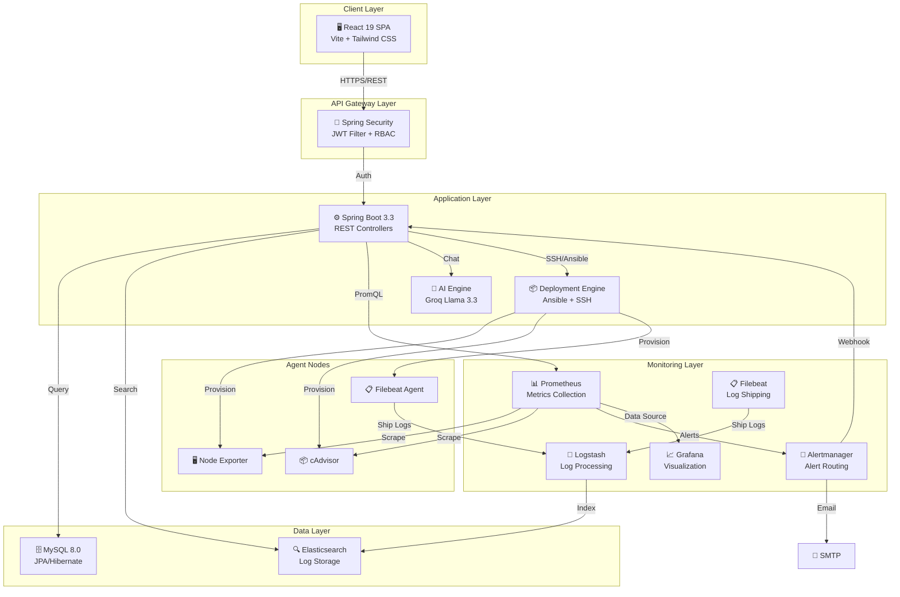

## 6.2 Request Lifecycle

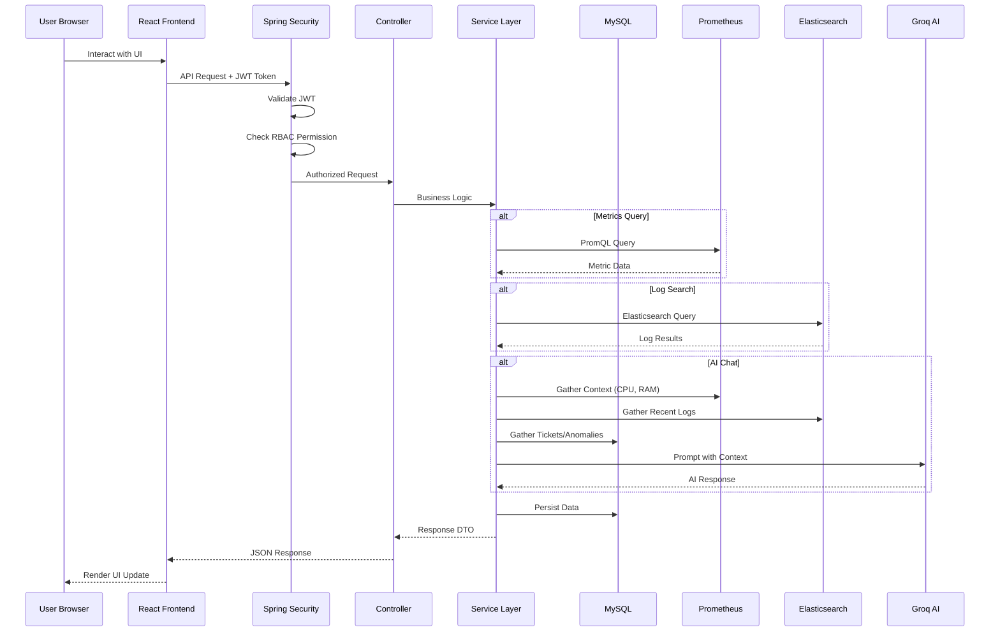

## 6.3 Deployment Flow

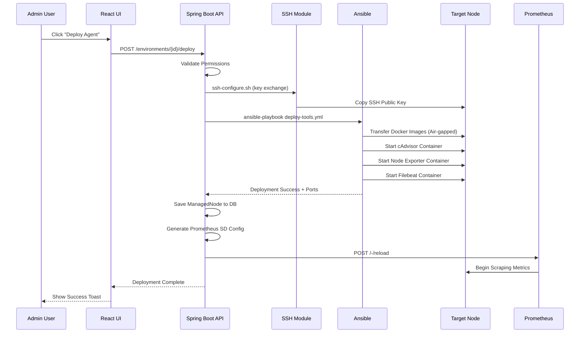

## 6.4 CI/CD Pipeline Architecture

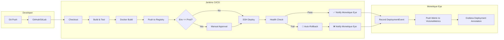

## 6.5 Infrastructure Architecture

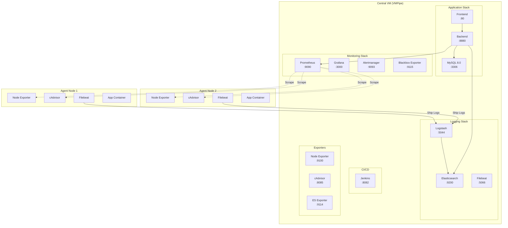

---

# 7. ⚙️ Backend Architecture

## 7.1 Package Structure

```
com.monetique.eye/
├── 📂 config/          # Security, CORS, JWT, WebConfig, DataInitializer
├── 📂 controller/      # 31 REST controllers (API endpoints)
├── 📂 dto/             # 16 Data Transfer Objects
├── 📂 entity/          # 25 JPA entities + 6 enums
├── 📂 repository/      # 25 Spring Data JPA repositories
├── 📂 service/         # 32 business services
├── 📂 security/        # AOP-based permission enforcement
├── 📂 scheduler/       # Scheduled tasks
├── 📂 client/          # External API clients
├── 📂 util/            # JWT utilities, helpers
└── 📄 MonetiqueEyeApplication.java
```

## 7.2 Key Services

| Service | Lines | Responsibility |
|:---|:---|:---|
| **DeploymentService** | 1,406 | Full application lifecycle: deploy, undeploy, restart, canary, promote |
| **InfrastructureService** | 905 | Topology generation, service resource discovery, heatmaps, stability score |
| **LogAnalyticsService** | ~67K bytes | Log aggregation, trend analysis, recurring pattern detection |
| **PrometheusClient** | ~18K bytes | PromQL query execution, metric aggregation, node/container metrics |
| **AiChatService** | 206 | Context-aware AI chat with conversation history and real-time metrics |
| **AlertGroupService** | ~10K bytes | Alert grouping, AI-powered root cause analysis |
| **NetworkMetricsProxyService** | ~14K bytes | Network topology, latency, packet loss monitoring |
| **NodeMonitoringService** | ~11K bytes | Deep node-level metrics (CPU, RAM, disk, processes) |
| **CicdTrackingService** | ~4K bytes | Deployment event recording and VictoriaMetrics integration |
| **PermissionService** | ~3K bytes | Fine-grained RBAC permission checks |

## 7.3 Authentication Flow

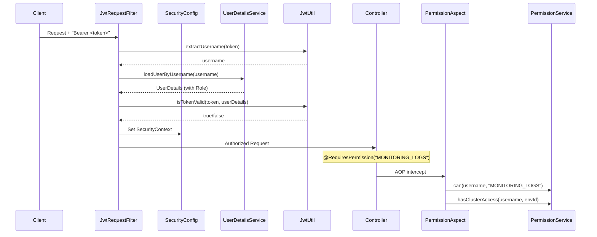

## 7.4 Resilience Patterns

- **Resilience4j Circuit Breaker** (`resilience4j-spring-boot3 v2.2.0`) protects external API calls (Groq, Prometheus)
- **Graceful AI Degradation**: `GroqService` wraps all calls in try/catch, returning "AI Summary unavailable" on failure
- **Non-blocking Notifications**: Jenkins deployment notification (`notifyDeployment`) is always wrapped in try/catch — a monitoring failure never blocks deployments
- **Async Deployments**: All deployment operations use `@Async` with `CompletableFuture` to avoid blocking the request thread

## 7.5 Database Communication

- **JPA/Hibernate** with `spring-boot-starter-data-jpa`
- **MySQL Connector/J** (`mysql-connector-j`) for MySQL 8.0 connectivity
- **Flyway** (`flyway-core` + `flyway-mysql`) for version-controlled migrations
- **Connection Parameters**: `connectTimeout=5000`, `socketTimeout=30000`, `allowPublicKeyRetrieval=true`

---

# 8. 🎨 Frontend Architecture

## 8.1 Framework & Build

| Aspect | Technology |
|:---|:---|
| **Framework** | React 19 with TypeScript 6 |
| **Build Tool** | Vite 8.0.4 |
| **Styling** | Tailwind CSS 4.2.2 with PostCSS |
| **Deployment** | Multi-stage Docker: Node 20 Alpine build → Nginx 1.21.3 Alpine serve |

## 8.2 Application Structure

```
frontend/src/
├── 📄 App.tsx              # Root component with routing
├── 📄 main.tsx             # React entry point with providers
├── 📂 pages/ (21 pages)    # Full page components
├── 📂 components/          # Reusable UI components
│   ├── layout/             # Sidebar, Header, ChatWidget
│   ├── applications/       # Application-specific components
│   ├── environment/        # Environment management components
│   ├── incidents/          # Incident components
│   ├── network/            # Network monitoring components
│   ├── operational/        # Operational intelligence components
│   └── ui/                 # Generic UI components
├── 📂 context/ (3)         # React contexts (Auth, Cluster, Environment)
├── 📂 services/ (2)        # API client and Prometheus service
├── 📂 observability/       # Node monitoring components
├── 📂 hooks/               # Custom React hooks
├── 📂 types/               # TypeScript type definitions
├── 📂 constants/           # App constants
└── 📂 assets/              # Static assets
```

## 8.3 State Management

| Context | Purpose |
|:---|:---|
| **AuthContext** | JWT token, user info, permissions, login/logout |
| **ClusterContext** | Selected cluster, cluster list, global scope persistence |
| **EnvironmentContext** | Selected environment, CRUD operations, loading states |

All contexts use React's built-in `createContext` + `useContext` pattern with `localStorage` persistence for session continuity.

## 8.4 Routing Architecture

| Route | Component | Protection |
|:---|:---|:---|
| `/login` | LoginPage | Public |
| `/setup` | SetupWizard | Admin + !Initialized |
| `/` | DashboardPage | Protected |
| `/environments` | EnvironmentsPage | Protected |
| `/applications` | ApplicationsPage | Protected |
| `/observability/apps` | ApplicationObservabilityPage | Protected |
| `/observability/apps/:appId/dashboard` | AppMetricsDashboard | Protected |
| `/observability/nodes` | NodeMonitoringPage | Protected |
| `/operational` | OperationalIntelligence | Protected |
| `/network-monitor` | NetworkMonitor | Protected |
| `/infrastructure` | InfrastructureTopologyPage | Protected |
| `/logs` | LogsPage | Protected |
| `/analyse` | AnalysePage | Protected |
| `/tickets` | TicketsPage | Protected |
| `/chat` | ChatPage | Protected |
| `/audit-log` | AuditLogPage | Protected |
| `/documentation` | DocumentationPage | Protected |
| `/settings` | UserManagementPage | Admin Only |

## 8.5 API Communication

- **Axios** with interceptor for automatic JWT `Authorization: Bearer <token>` header injection
- **Base URL** configured via `VITE_API_URL` environment variable (build-time injection)
- **Error Handling**: Global interceptor redirects to `/service-unavailable` on network errors

---

# 9. 🗄️ Database Design

## 9.1 Databases Used

| Database | Purpose | Why Chosen |
|:---|:---|:---|
| **MySQL 8.0** | Primary relational store for entities, users, permissions | ACID-compliant, strong JPA/Hibernate support, mature ecosystem |
| **Elasticsearch 7.17.9** | Log storage, full-text search, time-series log indexing | Sub-second log search across millions of entries, aggregation pipelines |

## 9.2 Entity-Relationship Diagram

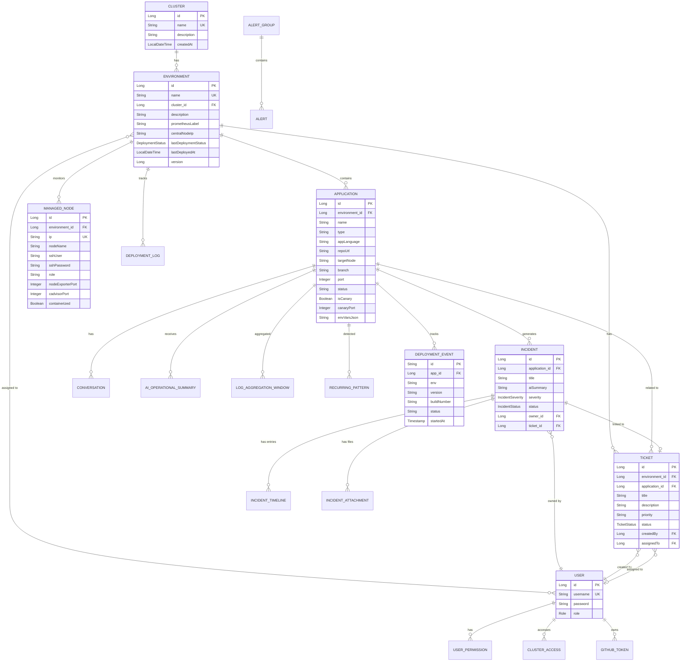

## 9.3 Elasticsearch Index Strategy

| Index Pattern | Source | Content |
|:---|:---|:---|
| `app-logs-{environment}-{date}` | Filebeat / TCP | Application and container logs per environment |
| `loki-logs-{date}` | Loki poller | External Loki-sourced logs (deduplicated via SHA1 fingerprint) |

### Log Enrichment Pipeline

Logstash normalizes every log entry with:
- **`severity`**: AUTO-detected from log level keywords (ERROR, WARN, INFO, DEBUG)
- **`category`**: Classified as DATABASE, SECURITY, NETWORK, EXTERNAL, or APPLICATION
- **`service_name`**: Extracted from Docker labels, container names, or Loki metadata
- **`environment`**: Extracted from Docker labels or node hostname
- **`normalized_summary`**: Human-readable `[CATEGORY] message` format

---

# 10. 🐳 DevOps & Infrastructure

## 10.1 Docker Usage

### Multi-Stage Builds

**Backend Dockerfile:**
```dockerfile
# Build: Maven 3.9.6 + Eclipse Temurin 21
FROM maven:3.9.6-eclipse-temurin-21 AS build
# Install: Ansible, SSH, Docker CLI in runtime
FROM eclipse-temurin:21-jre-alpine
RUN apk add --no-cache bash ansible sshpass openssh-client dos2unix git docker-cli
```

**Frontend Dockerfile:**
```dockerfile
# Build: Node 20 Alpine
FROM node:20-alpine AS build
# Serve: Nginx 1.21.3 Alpine
FROM nginx:1.21.3-alpine
```

### Docker Compose Services (14 containers)

| Service | Image | Port | Purpose |
|:---|:---|:---|:---|
| `mysql` | mysql:8.0 | 3306 | Primary database |
| `backend` | custom build | 8880 | Spring Boot API |
| `frontend` | custom build | 80 | React SPA (Nginx) |
| `prometheus` | prom/prometheus:latest | 9090 | Metrics collection |
| `grafana` | grafana/grafana:latest | 3000 | Dashboards |
| `alertmanager` | prom/alertmanager:latest | 9093 | Alert routing |
| `elasticsearch` | elasticsearch:7.17.9 | 9200 | Log storage |
| `logstash` | logstash:7.17.9 | 5044 | Log processing |
| `filebeat` | filebeat:8.11.1 | 5066 | Log shipping |
| `node-exporter` | prom/node-exporter:latest | 9100 | Host metrics |
| `cadvisor` | gcr.io/cadvisor:latest | 8085 | Container metrics |
| `blackbox-exporter` | prom/blackbox-exporter:latest | 9115 | Endpoint probing |
| `elasticsearch-exporter` | prometheuscommunity/es-exporter:v1.5.0 | 9114 | ES metrics |
| `jenkins` | jenkins/jenkins:lts | 8082 | CI/CD server |

## 10.2 Ansible Infrastructure

### Playbooks

| Playbook | Purpose |
|:---|:---|
| `deploy-tools.yml` | Deploy Node Exporter + cAdvisor + Filebeat (containerized or standalone) |
| `deploy-app.yml` | Full application deployment (clone, build, dockerize, run) |
| `deploy-backend.yml` | Backend-specific deployment |
| `deploy-frontend.yml` | Frontend-specific deployment |
| `deploy_blackbox_exporter.yml` | Blackbox exporter provisioning |
| `undeploy-app.yml` | Application removal |
| `undeploy-node.yml` | Complete node cleanup |
| `restart-app.yml` | Application restart |

### Air-Gapped Deployment Strategy

The `deploy-tools.yml` playbook implements a sophisticated **air-gapped deployment pattern**:

1. **Controller-side caching**: Docker images are `docker save`-d to `/app/gitops/image-cache/` on first run
2. **SCP transfer**: Tarballs are `copy`-ed to `~/monetique-images/` on the remote node
3. **Remote loading**: `docker load -i` imports images without internet access
4. **Cleanup**: Tarballs are removed from the remote after loading

### Standalone Mode (Non-Docker)

For nodes without Docker:
1. Node Exporter binary is downloaded and cached on the controller
2. Binary is transferred and extracted to `~/node-exporter/`
3. A **systemd user service** is created at `~/.config/systemd/user/node-exporter.service`
4. No root/sudo privileges required on the remote node

## 10.3 Jenkins CI/CD Pipelines

### Pipeline Architecture

Three Jenkinsfiles in `gitops/jenkins/pipelines/`:

| Pipeline | Purpose | Parameterized |
|:---|:---|:---|
| `Jenkinsfile.frontend` | Frontend build, test, Docker build, deploy, health check | APP_ID, APP_NAME, ENV, GIT_REPO, GIT_BRANCH, TARGET_VM_IP, HOST_PORT |
| `Jenkinsfile.backend` | Backend build (Maven), test, Docker build, deploy, health check | Same parameters + DB credentials |
| `Jenkinsfile.gitops` | Monitoring tool config sync and version upgrades | Triggered by GitOps repo changes |

### Deployment Workflow

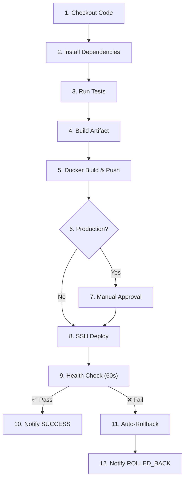

### Secrets Strategy

Jenkins Credentials store only (no Vault, no Spring Cloud):
- `DOCKER_REGISTRY_URL` — Secret text
- `DOCKER_REGISTRY_CREDS` — Username/password
- `SSH_DEPLOY_KEY` — SSH private key
- `MONETIQUE_EYE_URL` — Secret text
- `DB_URL_{env}` / `DB_PASS_{env}` — Per-environment database credentials

## 10.4 Deployment Flow (Step-by-Step)

1. **Admin clicks "Deploy"** in the Monetique Eye UI
2. **Backend validates permissions** (RBAC check + environment scope)
3. **SSH key exchange** via `ssh-configure.sh` (sshpass + ssh-copy-id)
4. **Ansible inventory updated** with new host in the correct environment group
5. **Ansible playbook executed** — transfers Docker images, starts containers
6. **ManagedNode saved** to MySQL with detected ports and credentials
7. **Prometheus SD config generated** — file_sd YAML written with new targets
8. **Prometheus hot-reloaded** via `POST /-/reload`
9. **Metrics begin flowing** within 15 seconds (scrape interval)

---

# 11. 📊 Monitoring & Observability

## 11.1 Prometheus Configuration

### Scrape Jobs (13 configured)

| Job | Target | Interval | Discovery |
|:---|:---|:---|:---|
| `monetique-backend` | Backend actuator | 15s | file_sd |
| `central-node` | Prometheus self | 15s | static |
| `node-exporter` | Host metrics | 15s | file_sd |
| `cadvisor` | Container metrics | 15s | file_sd |
| `filebeat` | Log agent metrics | 15s | file_sd |
| `elasticsearch` | ES exporter | 15s | static |
| `alertmanager` | Alert metrics | 15s | static |
| `grafana` | Dashboard metrics | 15s | static |
| `blackbox` | HTTP probes | 15s | file_sd |
| `network-monitor-dynamic` | Dynamic probes | 15s | file_sd (conf.d) |
| `process-exporter` | Process metrics | 15s | file_sd |

### Alert Rules (12 rules in 3 groups)

| Group | Alert | Severity | Condition |
|:---|:---|:---|:---|
| **System** | NodeUnreachable | Critical | `up{job='node-exporter'} == 0` for 1m |
| **System** | HighCpuUsage | Warning | CPU > 85% for 2m |
| **System** | HighMemoryUsage | Warning | RAM > 90% for 2m |
| **System** | NodeDiskSpaceLow | Warning | Disk free < 15% for 5m |
| **Application** | FrontendDown | Critical | Container last_seen > 60s for 2m |
| **Application** | BackendDown | Critical | `up == 0` or container stopped for 2m |
| **Application** | HighErrorRate | Critical | 5xx rate > 5% for 2m |
| **Application** | HighLatency | Warning | P95 latency > 2s for 5m |
| **Container** | ContainerOOMKilled | Critical | OOM events detected |
| **Container** | ContainerHighMemory | Warning | Memory > 90% of limit for 5m |
| **Container** | ContainerHighCPU | Warning | CPU > 90% for 5m |
| **Container** | ContainerRestartLoop | Critical | > 2 restarts in 15m |

## 11.2 Alertmanager Configuration

### Routing Strategy

```
Root Route
├── severity: critical → monetique-backend (webhook) + email-critical
├── severity: warning  → monetique-backend (webhook) + email-notifications
└── default            → monetique-backend (webhook)
```

### Receivers

| Receiver | Type | Target |
|:---|:---|:---|
| `monetique-backend` | Webhook | `http://backend:8880/api/alerts/ingest` |
| `email-critical` | SMTP | Gmail SMTP → configurable recipient (1h repeat) |
| `email-notifications` | SMTP | Gmail SMTP → configurable recipient (4h repeat) |

### Inhibition Rules
- **Critical suppresses Warning** for the same `alertname` + `instance` — prevents noise during cascading failures

## 11.3 ELK Stack (Logging Pipeline)

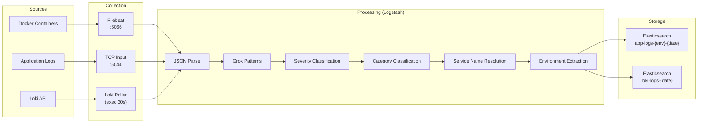

### Metrics Monitored

| Category | Metrics | Purpose |
|:---|:---|:---|
| **Host** | CPU, RAM, Disk, Network I/O | Infrastructure health |
| **Container** | CPU/Memory usage, restarts, OOM events, start time | Service health |
| **Application** | HTTP request count/latency/errors (via Micrometer) | SLA tracking |
| **Network** | Blackbox probe results, packet loss, latency | Network health |
| **Elasticsearch** | Cluster health, index size, query latency | Log infra health |
| **Process** | Named process CPU/Memory (via process-exporter) | Standalone service monitoring |

---

# 12. 🔐 Security Implementation

## 12.1 Authentication Architecture

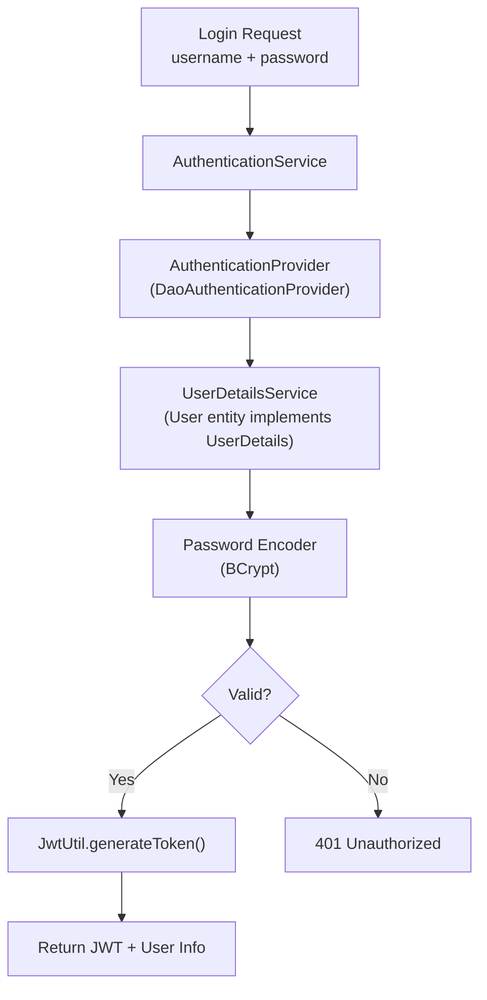

## 12.2 Authorization Model

### Role-Based Access Control (RBAC)

| Role | Capabilities |
|:---|:---|
| **ADMIN** | Full platform access, user management, environment CRUD, deployment |
| **USER** | Environment-scoped access, view monitoring, create tickets |

### Fine-Grained Permission Keys

| Permission Key | Scope | Description |
|:---|:---|:---|
| `CLUSTER_ACCESS` | Global | Access to clusters feature |
| `MONITORING_OBSERVABILITY` | Environment | View observability dashboards |
| `MONITORING_LOGS` | Environment | View and search logs |
| `MONITORING_INFRA_GRAPH` | Environment | View infrastructure topology |
| `ENV_DEPLOYMENT_VIEW` | Environment | View environments |
| `ENV_DEPLOYMENT_CREATE` | Global | Create new environments |
| `ENV_DEPLOYMENT_EDIT` | Environment | Modify environments |
| `ENV_DEPLOYMENT_DELETE` | Environment | Delete environments |
| `APP_DEPLOYMENT_VIEW` | Environment | View applications |
| `APP_DEPLOYMENT_CREATE` | Environment | Start new deployments |
| `APP_DEPLOYMENT_EDIT` | Environment | Restart or modify applications |
| `APP_DEPLOYMENT_DELETE` | Environment | Delete applications |
| `INCIDENTS_VIEW` | Environment | View incident tickets |
| `INCIDENTS_CREATE` | Environment | Create incident tickets |
| `INCIDENTS_EDIT` | Environment | Modify incident tickets |
| `INCIDENTS_DELETE` | Environment | Delete incident tickets |
| `CHATBOT_ACCESS` | Global | Access AI assistant |

### AOP-Based Enforcement

```java
@RequiresPermission("APP_DEPLOYMENT_CREATE")
@PostMapping("/applications/{environmentId}/deploy")
public ResponseEntity<?> deployApplication(...) { ... }
```

The `PermissionAspect` automatically:
1. Extracts the username from `SecurityContext`
2. Checks base permission via `PermissionService.can()`
3. Resolves the environment ID from method parameters (supports `@PathVariable`, `@RequestParam`)
4. Validates cluster/environment scope access

## 12.3 Security Controls

| Control | Implementation |
|:---|:---|
| **CSRF Protection** | Disabled (stateless JWT API) |
| **CORS** | Configurable allowed origins |
| **Session Policy** | `STATELESS` — no server-side sessions |
| **Password Hashing** | BCrypt via Spring Security |
| **JWT Signing** | HMAC-SHA256 with configurable 180-char secret |
| **JWT Expiration** | Configurable (default: 3600s) |
| **Actuator Bypass** | `/actuator/**` excluded from JWT (for Prometheus scraping) |
| **Alert Webhook Bypass** | `/api/alerts/ingest` excluded (for Alertmanager) |
| **SSH Key Exchange** | Automated `ssh-copy-id` via `ssh-configure.sh` |
| **Credential Storage** | ManagedNode SSH creds in MySQL, Jenkins creds in Jenkins Credentials store |

---

# 13. 📈 Scalability & High Availability

## 13.1 Horizontal Scaling

| Component | Scaling Strategy |
|:---|:---|
| **Agent Nodes** | Unlimited — dynamic file_sd discovery, no Prometheus restart required |
| **Applications** | Per-node deployment via Ansible, each app gets its own container |
| **Log Ingestion** | Logstash TCP/Beats inputs accept multiple concurrent shippers |
| **Prometheus Targets** | File-based SD supports thousands of targets per scrape job |

## 13.2 Fault Tolerance Patterns

| Pattern | Implementation |
|:---|:---|
| **Circuit Breaker** | Resilience4j wraps Groq AI, Prometheus, and external service calls |
| **Auto-Rollback** | Jenkins health check failure triggers automatic rollback to previous image |
| **Graceful Degradation** | AI features return safe defaults on failure |
| **Service Restart** | `restart: always` / `unless-stopped` on all Docker containers |
| **Health Checks** | MySQL ping, Prometheus readiness, Backend actuator health |
| **Idempotent Deployment** | Ansible playbooks detect existing containers and skip redundant tasks |
| **Async Processing** | `@Async` deployment methods prevent request thread blocking |
| **Data Backup** | GitOps pipeline takes VictoriaMetrics snapshots and ES snapshots before upgrades |

## 13.3 Resilience Architecture

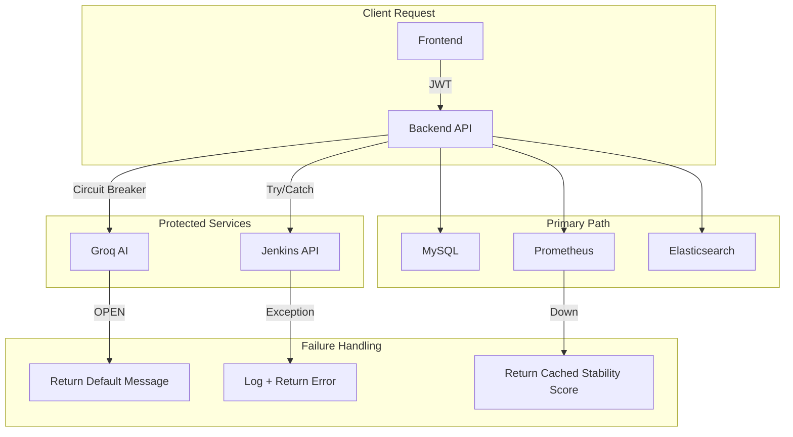

---

# 14. 🔄 CI/CD Pipeline

## 14.1 Full Pipeline Architecture

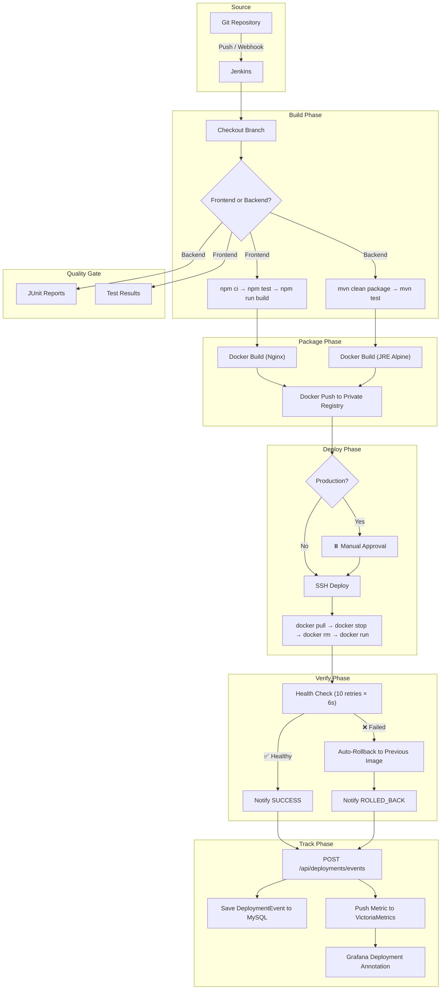

## 14.2 GitOps Tooling Pipeline

The `Jenkinsfile.gitops` pipeline manages monitoring infrastructure updates:

1. **Detect Changes** — `git diff --name-only HEAD~1 HEAD`
2. **Conditional Sync** — only affected components are updated:
   - Prometheus config → `cp + promtool check + /-/reload`
   - Alertmanager config → `cp + /-/reload`
   - Logstash pipelines → `cp + docker restart + health check`
   - Grafana provisioning → `cp + docker restart + health check`
3. **Version Upgrades** — if `versions.yml` changed:
   - **Backup first** (VictoriaMetrics snapshot + ES filesystem snapshot)
   - **Verify backup succeeded** before proceeding
   - Stop → Remove → Run with new version → Health check
4. **Final Health Check** — all 6 monitoring services verified

---

# 15. 🧩 Challenges Encountered

## 15.1 Technical Challenges

| Challenge | Root Cause | Solution |
|:---|:---|:---|
| **Air-gapped node provisioning** | Remote nodes without internet access can't pull Docker images | Docker images pre-exported as tarballs on controller, transferred via SCP, loaded locally |
| **Non-root node monitoring** | Some environments don't allow Docker or root access | Standalone mode: Node Exporter as a systemd user service (no root needed) |
| **Python detection on remote** | Ansible requires Python but path varies across distributions | `raw: which python3 || which python` pre-task discovers interpreter dynamically |
| **Prometheus target explosion** | Adding nodes required manual config changes and restarts | File-based service discovery with auto-generated YAML + hot-reload API |
| **Multi-source log normalization** | Logs from Filebeat, TCP, and Loki have wildly different formats | Unified Logstash pipeline with 6 grok patterns, JSON fallback, category classification |
| **Log deduplication** | Loki poller produces duplicate entries on overlapping windows | SHA1 fingerprint on `[message, @timestamp]` with Elasticsearch `document_id` |
| **Container name resolution** | Docker Compose prefixes and suffixes obscure real service names | Multi-layer resolution: Docker labels → container name → compose service → Loki labels |
| **Environment-scoped security** | Standard Spring Security lacks environment-level isolation | Custom AOP `@RequiresPermission` with automatic environment ID extraction from method params |
| **cAdvisor port conflicts** | Multiple agents might use different ports for cAdvisor | Dynamic port detection from existing containers, persisted in ManagedNode entity |
| **CI/CD deployment tracking** | Jenkins and monitoring data are disconnected | `deployment_event` metric pushed to VictoriaMetrics → Grafana annotations |
| **Canary deployments** | Need to test new versions without affecting stable traffic | Canary flag on Application entity, `port + 1000` offset, auto-promote workflow |
| **Alertmanager secret injection** | SMTP credentials can't be hardcoded in config files | Entrypoint shell script with `sed` substitution from environment variables |

---

# 16. 🚀 Future Improvements

## 16.1 Short-Term Enhancements

| Improvement | Impact |
|:---|:---|
| **Kubernetes Support** | Native K8s integration for service mesh environments |
| **Live Log Streaming** | WebSocket-based real-time log tailing |
| **DORA Metrics Dashboard** | Deployment frequency, lead time, MTTR, change failure rate |
| **SonarQube Integration** | Code quality scanning in CI/CD pipeline |
| **Trivy Integration** | Container vulnerability scanning before deployment |

## 16.2 Medium-Term Evolution

| Improvement | Impact |
|:---|:---|
| **Distributed Tracing** | OpenTelemetry/Jaeger for cross-service request tracing |
| **Multi-Region Deployment** | Geographic distribution for global enterprise deployments |
| **Advanced Anomaly Detection** | ML-based anomaly detection on time-series data |
| **Cost Optimization Dashboard** | Resource utilization analysis with optimization recommendations |
| **Self-Healing Automation** | Auto-restart/scale services based on alert conditions |

## 16.3 Long-Term Vision

| Improvement | Impact |
|:---|:---|
| **Cloud-Native Migration** | Terraform + Cloud provider integration (AWS/GCP/Azure) |
| **Service Mesh Integration** | Istio/Linkerd for advanced traffic management |
| **AIOps Evolution** | Predictive failure detection, automated root cause analysis |
| **Compliance Dashboard** | SOC 2, PCI-DSS compliance reporting |
| **Multi-Tenant SaaS** | White-label platform for multiple organizations |

---

# 17. ✅ Conclusion

## 17.1 Achievements

Monetique Eye successfully delivers:

- **A unified observability platform** that consolidates metrics, logs, alerts, incidents, and CI/CD tracking into a single, cohesive interface
- **One-click infrastructure provisioning** that reduces node onboarding from hours to minutes, supporting both containerized and standalone environments
- **AI-powered operational intelligence** with Groq Llama 3.3, providing real-time infrastructure insights, log analysis, and anomaly detection
- **Enterprise-grade security** with JWT authentication, fine-grained RBAC, and environment-scoped access control
- **Production-ready DevOps infrastructure** with Jenkins CI/CD pipelines, automated health checks, rollback mechanisms, and GitOps version management

## 17.2 Technical Value

| Metric | Achievement |
|:---|:---|
| **Codebase Scale** | 31 controllers, 32 services, 25 entities, 25 repositories, 21 frontend pages |
| **Infrastructure** | 14 Docker containers orchestrated via Compose |
| **Monitoring Coverage** | 13 Prometheus scrape jobs, 12 alert rules, 3 alert categories |
| **Security Model** | 16+ granular permissions, AOP-enforced environment-scoped RBAC |
| **DevOps Automation** | 8 Ansible playbooks, 3 Jenkins pipelines, air-gapped deployment support |

## 17.3 Learning Outcomes

This project demonstrates mastery across:

- **Full-stack development** (Spring Boot 3.3 + React 19 + TypeScript)
- **Infrastructure as Code** (Ansible, Docker, Docker Compose)
- **Observability engineering** (Prometheus, Grafana, ELK Stack)
- **CI/CD pipeline design** (Jenkins, parameterized pipelines, rollback)
- **Security architecture** (JWT, RBAC, AOP-based enforcement)
- **AI integration** (LLM-powered operational intelligence)
- **GitOps practices** (version-controlled infrastructure, automated sync)

## 17.4 Future Impact

Monetique Eye establishes a foundation for enterprise-scale infrastructure observability in the financial services sector. Its modular architecture, AI capabilities, and one-click provisioning model position it for evolution into a cloud-native, multi-tenant SaaS platform capable of serving organizations across industries requiring critical infrastructure monitoring and compliance.

---

## 📂 Folder Structure Reference

```
monetique-eye/
├── 📂 backend/                          # Spring Boot 3.3 API Service
│   ├── 📄 Dockerfile                    # Multi-stage Maven + JRE Alpine
│   ├── 📄 pom.xml                       # Maven dependencies (18 dependencies)
│   ├── 📄 .env                          # Environment configuration
│   └── 📂 src/main/java/com/monetique/eye/
│       ├── 📄 MonetiqueEyeApplication.java
│       ├── 📂 config/                   # SecurityConfig, JwtFilter, CORS, DataInit
│       ├── 📂 controller/              # 31 REST controllers
│       ├── 📂 dto/                     # 16 DTOs
│       ├── 📂 entity/                  # 25 entities + 6 enums
│       ├── 📂 repository/             # 25 JPA repositories
│       ├── 📂 service/                # 32 business services
│       ├── 📂 security/              # PermissionAspect + @RequiresPermission
│       ├── 📂 scheduler/             # Scheduled tasks
│       ├── 📂 client/                # External API clients
│       └── 📂 util/                  # JwtUtil, helpers
│
├── 📂 frontend/                         # React 19 + Vite SPA
│   ├── 📄 Dockerfile                    # Multi-stage Node + Nginx
│   ├── 📄 package.json                  # 14 deps + 12 devDeps
│   ├── 📄 nginx.conf                   # SPA routing configuration
│   ├── 📄 vite.config.ts               # Vite build configuration
│   ├── 📄 tailwind.config.js           # Tailwind CSS configuration
│   └── 📂 src/
│       ├── 📄 App.tsx                   # Root routing (22 routes)
│       ├── 📂 pages/ (21)             # Full page components
│       ├── 📂 components/            # Reusable UI components
│       ├── 📂 context/ (3)           # Auth, Cluster, Environment
│       ├── 📂 services/ (2)          # API client, Prometheus service
│       ├── 📂 observability/         # Node monitoring
│       ├── 📂 types/                 # TypeScript definitions
│       └── 📂 hooks/                 # Custom React hooks
│
├── 📂 gitops/                           # Infrastructure as Code
│   ├── 📄 versions.yml                  # Tool version registry
│   ├── 📄 README_GITOPS.md             # GitOps documentation
│   ├── 📂 ansible/                     # 8 Ansible playbooks + inventory
│   ├── 📂 jenkins/pipelines/          # 3 Jenkinsfiles (frontend, backend, gitops)
│   ├── 📂 scripts/                    # 5 shell scripts (SSH, deploy, prepare)
│   ├── 📂 vmpipe/                     # Central VM orchestration
│   │   ├── 📄 docker-compose.yml      # 14 services
│   │   ├── 📂 prometheus/            # Config, alert rules, file_sd
│   │   ├── 📂 alertmanager/          # Config + email templates
│   │   ├── 📂 logstash/             # Log processing pipeline
│   │   ├── 📂 filebeat/             # Log shipping config
│   │   ├── 📂 grafana/              # Dashboard provisioning
│   │   ├── 📂 elasticsearch/        # ES configuration
│   │   └── 📂 blackbox/             # HTTP probe config
│   ├── 📂 monitoring/               # Versioned monitoring configs
│   └── 📂 prometheus/               # Dynamic file_sd targets
│
├── 📂 documentation/                    # Technical docs & diagrams
│   ├── 📂 docs/                        # Architecture, structure, operations guides
│   ├── 📂 diagram/                    # Visual diagrams
│   └── 📄 incidents_and_alerts.md     # Alert system documentation
│
├── 📄 README.md                         # Project overview
├── 📄 CICD_feature.md                   # CI/CD implementation specification
└── 📄 PROJECT_PRESENTATION.md          # This document
```

---

## 🏛️ Architecture Decision Records

| Decision | Choice | Rationale |
|:---|:---|:---|
| **Backend Framework** | Spring Boot 3.3 | Mature ecosystem, enterprise-grade, excellent Spring Security |
| **Frontend Framework** | React 19 + Vite | Component-based, fastest build tool, TypeScript-first |
| **Database** | MySQL 8.0 | ACID compliance for financial sector, JPA support |
| **Log Storage** | Elasticsearch 7.17.9 | Full-text search, time-series indexing, aggregation pipelines |
| **Metrics System** | Prometheus + file_sd | Pull-based (secure), dynamic target discovery, PromQL |
| **AI Provider** | Groq (Llama 3.3 70B) | Fastest inference speed, open-source model, cost-effective |
| **CI/CD** | Jenkins | Pipeline-as-code, parameterized builds, mature plugin ecosystem |
| **Provisioning** | Ansible | Agentless, SSH-based, idempotent, air-gapped support |
| **Containerization** | Docker Compose | Single-command deployment, service dependencies, health checks |
| **Authentication** | JWT (stateless) | Scalable, no server-side session, API-friendly |
| **RBAC Implementation** | AOP + Custom Annotations | Declarative, environment-scoped, automatic parameter extraction |
| **Secrets Management** | Environment variables + Jenkins Credentials | Simple, appropriate for single-cluster scale |
| **Frontend Deployment** | Nginx + SPA routing | Production-grade static serving, API proxy capability |
| **Log Processing** | Logstash | Multi-input support, rich filter plugins, grok patterns |

---

## 🏅 Best Practices Used

| Category | Practice |
|:---|:---|
| **Architecture** | Layered architecture (Controller → Service → Repository) |
| **Security** | Defense in depth (JWT + RBAC + Environment Scope + Actuator bypass) |
| **DevOps** | Infrastructure as Code, GitOps version control, immutable deployments |
| **CI/CD** | Pipeline-as-code, automated rollback, health check gating |
| **Monitoring** | RED method (Rate, Errors, Duration), USE method (Utilization, Saturation, Errors) |
| **Alerting** | Severity-based routing, inhibition rules, webhook + email dual-channel |
| **Database** | Flyway migrations, optimistic locking (`@Version`), JPA relationships |
| **Frontend** | Context-based state, protected routes, type-safe API calls |
| **Docker** | Multi-stage builds, Alpine base images, resource limits |
| **Code Quality** | Lombok for boilerplate, DTO pattern, builder pattern |

---

> 📄 **Document generated**: June 2026 | **Platform Version**: 2.0.0  
> 🔭 *Monetique Eye — See everything. Fix anything. Deploy anywhere.*
