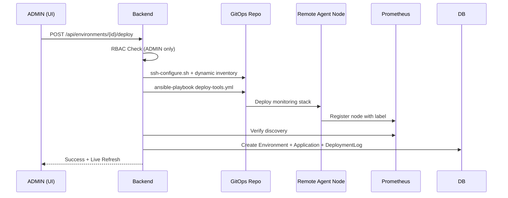
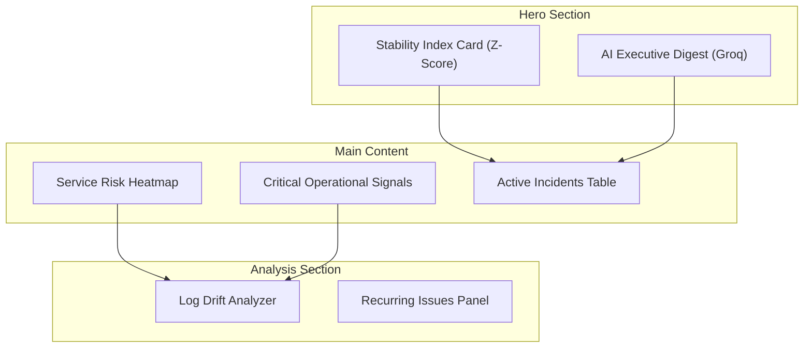
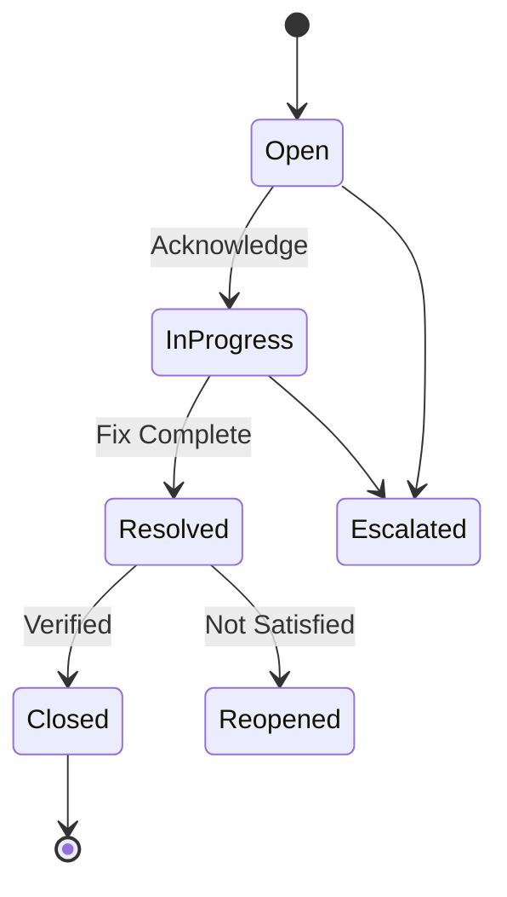
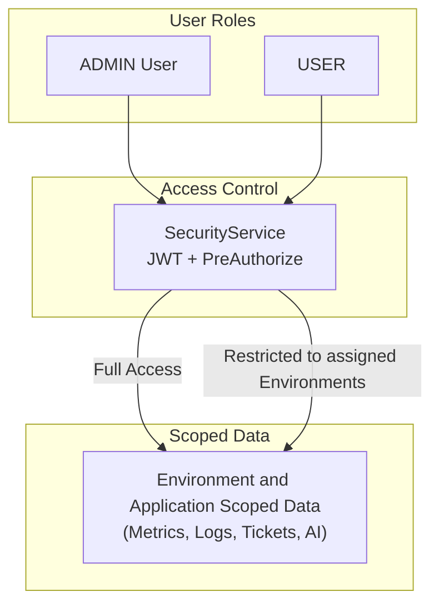

# Monetique-Eye – All Architecture Diagrams

> Last Updated: April 2026

## 1. Overall Platform Context

```mermaid
C4Context
    title Monetique-Eye Platform Context Diagram

    Person(Admin, "Platform Admin", "Manages environments and deployments")
    Person(EndUser, "End User", "Monitors systems and manages tickets")

    System_Boundary(monetique, "Monetique-Eye Platform") {
        System_Ext(UI, "React Executive Dashboard", "Dark themed UI")
        System(Backend, "Spring Boot Backend", "Core API and Deployment Service")
        SystemDb(MySQL, "MySQL 8.0", "Entities and audit logs")
        SystemDb(ES, "Elasticsearch", "Enriched logs")
    }

    System_Ext(GitOps, "GitOps Repository", "Ansible playbooks and scripts")
    System_Ext(Prometheus, "Prometheus", "Metrics scraping")
    System_Ext(AgentNodes, "Client Agent Nodes", "cAdvisor and Filebeat")

    Admin --> UI
    EndUser --> UI
    UI --> Backend
    Backend --> GitOps
    Backend --> Prometheus
    Backend --> ES
    Backend --> MySQL
    GitOps --> AgentNodes
```

## 2. Automated Deployment Sequence


## 3. Operational Intelligence Layout


## 4. Ticket Management Lifecycle


## 5. RBAC & Multi-Tenancy

