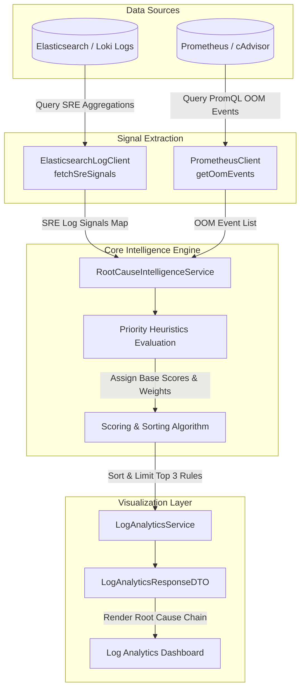

# Monetique Eye: Root Cause Intelligence Engine

The **Root Cause Intelligence Engine** is the core diagnostic brain of the Monetique Eye observability platform. Its primary objective is to automate incident troubleshooting for Site Reliability Engineers (SREs) and system operators by instantly answering the critical question:  
**"Why is my service down, and where did the problem originate?"**

By correlating container resource utilization, JVM runtime statistics, database connection pools, gateway access patterns, and microservice exceptions, the engine isolates the root cause from cascading downstream symptoms.

---

## 1. High-Level Architecture & Signal Pipeline

The engine utilizes a multi-source correlation architecture. It pulls log-based SRE signals from **Elasticsearch** and container-level metrics from **Prometheus** (via `cAdvisor` and `Node Exporter`) and merges them into a unified diagnostic flow.



---

## 2. Dynamic Data Sources & Signal Extraction

The engine relies on two specialized clients to extract raw indicators over a specified time window:

### A. Log-Based Signals (Elasticsearch)
Implemented in [ElasticsearchLogClientImpl.java](file:///c:/Users/youss/OneDrive/Documents/Work/monetique-eye/backend/src/main/java/com/monetique/eye/client/ElasticsearchLogClientImpl.java), the `fetchSreSignals` method issues a high-performance aggregated search query across the `app-logs-*` and `loki-logs-*` indices. Instead of returning raw log documents, it returns boolean flags indicating whether specific structural thresholds were breached:

| Signal Aggregation Key | Signal Purpose & Matching Pattern | Core Extraction Method / Query Rule |
| :--- | :--- | :--- |
| **`pool_active_max_match`** | DB Connection Pool Saturation | Inline Elasticsearch Painless Script:<br>`doc['pool_active'].value == doc['pool_max'].value && doc['pool_active'].value > 0` |
| **`db_wait_high`** | Connection Wait Time Bottleneck | Range query checking `wait_ms >= 5000` |
| **`oom_error_count`** | JVM Heap Exhaustion | Match query for `OutOfMemoryError` |
| **`heap_90_plus`** | Critically Low JVM Heap Headroom | Range query checking `heap_pct >= 90` |
| **`cb_open`** | Circuit Breaker Tripped | Term match checking `circuit_breaker_state.keyword` is `open` |
| **`npe_count`** | Application Exception Leakage | Term match checking `exception_type.keyword` is `java.lang.NullPointerException` |
| **`rate_limit_429`** | Gateway Traffic Rate Limiting | Term match checking `status_code` equals `429` |
| **`gateway_error_502`** | Bad Gateway / Ingress Failures | Term match checking `status_code` equals `502` |
| **`service_unavailable_503`** | Service Offline / Deployment Gap | Term match checking `status_code` equals `503` |
| **`conn_refused`** | Peer Network Outages | Match query for `"Connection refused"` in raw message field |

### B. Metric-Based Signals (Prometheus / cAdvisor)
Log events can occasionally be silent during sudden system terminations. To catch hard container terminations, the engine interacts with [PrometheusClient.java](file:///c:/Users/youss/OneDrive/Documents/Work/monetique-eye/backend/src/main/java/com/monetique/eye/service/PrometheusClient.java).  
The method `getOomEvents` executes a PromQL query against cAdvisor's cgroups metric collector:

```promql
max by (name) (
  changes(container_oom_events_total{name=~".*<appFilter>.*", environment=~"<envFilter>|.*"}[15m]) > 0
)
```
This identifies if the Linux kernel Out-Of-Memory (OOM) killer terminated the container in the last 15 minutes.

---

## 3. Scoring & Ranking Heuristics

The engine resolves diagnostics using the following structural hierarchy:  
> **Resource Saturation > Application Bug/Crash > Upstream Failure > Traffic Spike > Configuration**

When a signal fires, the engine assigns a **Base Score** (representing the category priority) plus **Evidence Weights** (representing the strength of the indicators).

### Heuristic Scoring Matrix

| Diagnostic Category | Priority | Base Score | Evidence Indicators & Weights | Maximum Potential Score | Resulting UI Type |
| :--- | :--- | :---: | :--- | :---: | :---: |
| **`DB_FAILURE`** | 1 (Highest) | **10.0** | • `pool.active=pool.max` detected: **+2.0**<br>• High connection wait time (>5s): **+1.5** | **13.5** | `root_cause` |
| **`MEMORY_OOM`** | 2 | **9.0** | • cAdvisor Kernel OOM Kill metric: **+8.0**<br>• `OutOfMemoryError` in log stream: **+5.0**<br>• Heap usage >90% detected: **+3.0** | **25.0** | `root_cause` |
| **`BUG_CRASH`** | 3 | **7.0** | • `NullPointerException` frequency: **+4.0** | **11.0** | `trigger` |
| **`SERVICE_UNREACHABLE`** | 4 | **5.0** | • Connection refused in peer logs: **+3.0**<br>• Ingress Gateway HTTP 502: **+2.0**<br>• Service HTTP 503: **+2.0** | **12.0** | `root_cause` |
| **`NETWORK_FAILURE`** | 5 | **4.0** | • Circuit-breaker `open` state in logs: **+2.5** | **6.5** | `impact` |
| **`TRAFFIC_SPIKE`** | 6 | **1.0** | • Ingress HTTP 429 (Too Many Requests): **+1.5** | **2.5** | `impact` |

---

## 4. Final Processing & Confidence Scoring

Once scores and logs of evidence are processed by [RootCauseIntelligenceService.java](file:///c:/Users/youss/OneDrive/Documents/Work/monetique-eye/backend/src/main/java/com/monetique/eye/service/RootCauseIntelligenceService.java), the engine:
1. **Sorts the categories** in descending order based on their cumulative score.
2. **Filters & Limits** the response to the **top 3** most probable failure modes to prevent alert fatigue.
3. **Calculates Confidence Levels** dynamically:
   - **High Confidence** (`score > 6.0`): Heavy evidence matches or high-priority resource saturation occurred (e.g. any confirmed DB or OOM event).
   - **Medium Confidence** (`score > 4.0`): Clear symptoms exist but indicators are less intense (e.g. isolated network breaker trips or standard unreachable codes).
   - **Low Confidence** (`score <= 4.0`): Signals matched but lack robust corroborating evidence.

### Fallback Mechanism
If the environment or service is experiencing elevated error frequencies (HTTP status $\ge 500$) but no specific patterns match the scoring engine, a fallback rule is returned:
* **Title**: `GENERAL APPLICATION ERRORS`
* **Type**: `trigger`
* **Confidence**: `low`
* **Evidence**: Aggregated `status_code >= 500` detected in Elasticsearch.

---

## 5. System & UI Integration

The Root Cause Intelligence engine is seamlessly embedded into the backend's query orchestration loop:

1. **Dashboard Dispatch**: When an operator loads the dashboard or views a critical incident ticket, `LogAnalyticsService.getDashboardData(...)` is invoked.
2. **Time and Context Isolation**: The orchestrator parses the time scope (e.g., `1h`, `24h`) and maps the target environment/service keywords to identify the exact deployment containers.
3. **Parallel Correlation**: The orchestrator triggers `rootCauseIntelligenceService.analyze(...)` in parallel with standard charts and metric summaries.
4. **UI Response**: The results are packed into `LogAnalyticsResponseDTO`'s `rootCauseChain` as a list of structured `RootCauseRule` instances:

```json
{
  "id": "7ca64bf1-0943-4cb7-a720-30ab8f51ef62",
  "type": "root_cause",
  "title": "MEMORY OOM",
  "description": "Evidence: Container OOM Kill event detected by cAdvisor/cgroups, OutOfMemoryError detected in log stream",
  "confidence": "high",
  "evidence": [
    "Container OOM Kill event detected by cAdvisor/cgroups",
    "OutOfMemoryError detected in log stream"
  ],
  "sources": ["Elasticsearch", "Logstash-SRE", "Prometheus", "cAdvisor"]
}
```

This structural diagnosis allows the frontend dashboard to display colored badges (e.g. red `root cause` alerts, amber `trigger` logs, and blue `impact` indicators) alongside an immediate **"Ask Claude ↗"** or **"Remediation Plan ↗"** button pre-loaded with the diagnostic logs for instant troubleshooting.

---

### Core Source Code References
* **Scoring Engine**: [RootCauseIntelligenceService.java](file:///c:/Users/youss/OneDrive/Documents/Work/monetique-eye/backend/src/main/java/com/monetique/eye/service/RootCauseIntelligenceService.java)
* **Log Ingest & SRE Aggregations**: [ElasticsearchLogClientImpl.java](file:///c:/Users/youss/OneDrive/Documents/Work/monetique-eye/backend/src/main/java/com/monetique/eye/client/ElasticsearchLogClientImpl.java)
* **Metric Collector**: [PrometheusClient.java](file:///c:/Users/youss/OneDrive/Documents/Work/monetique-eye/backend/src/main/java/com/monetique/eye/service/PrometheusClient.java)
* **API Ingestion Orchestrator**: [LogAnalyticsService.java](file:///c:/Users/youss/OneDrive/Documents/Work/monetique-eye/backend/src/main/java/com/monetique/eye/service/LogAnalyticsService.java)
